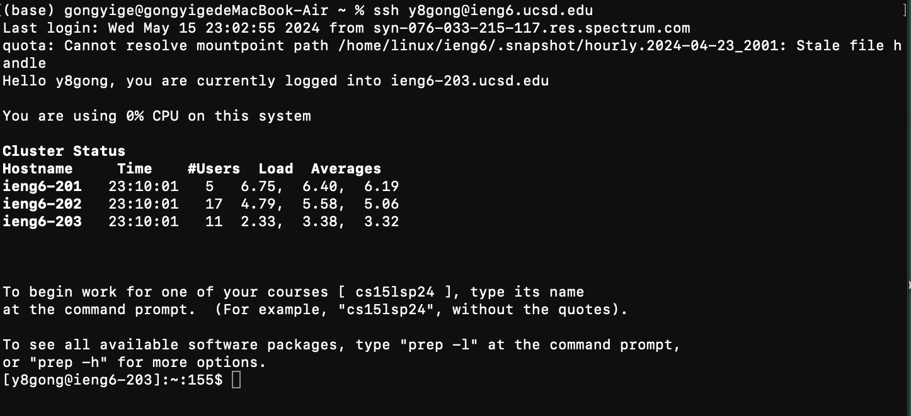
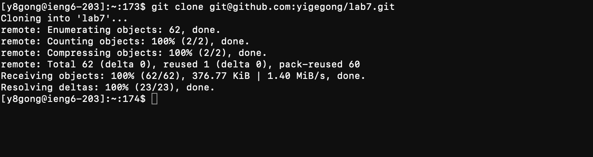
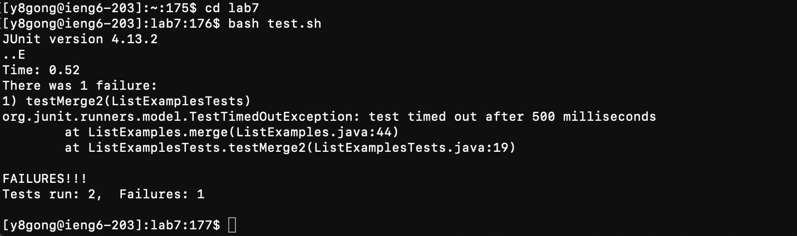
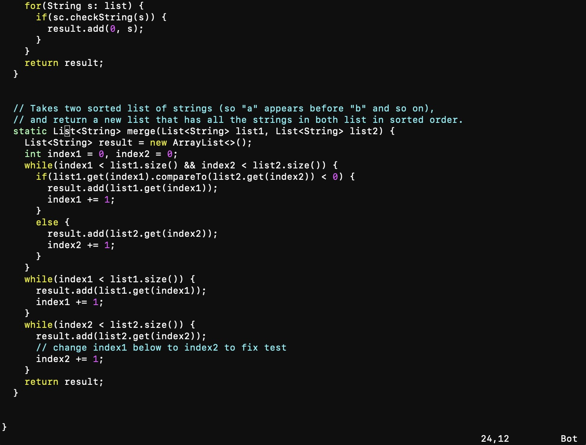
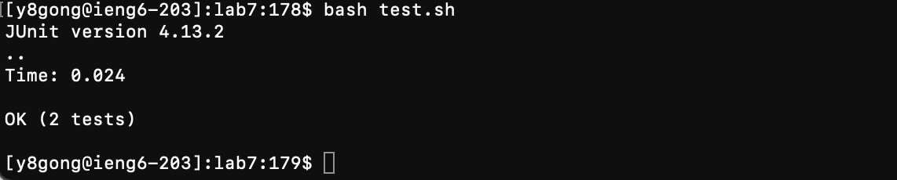
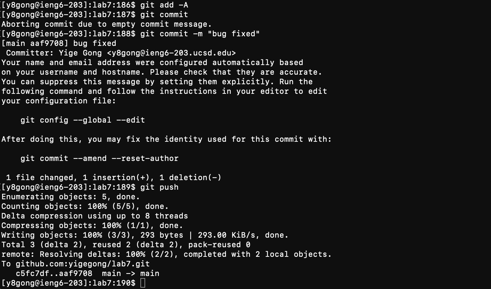

# lab7-report
## Step 4

## Step 4 Keys pressed:
```
ssh y8gong@ieng6.ucsd.edu <enter>
```
By entering this command, I logged into the ieng6 terminal.

## Step 5

## Step 5 Keys pressed:
```
git clone` <ctrl C> <ctrl V>
```

By entering `git clone` and copying the ssh URL `git@github.com:yigegong/lab7.git`, I cloned the forked lab7 directory into my terminal.

## Step 6

## Step 6 Keys pressed:
```
cd lab7
bash test.sh
```

`cd lab7` directs into the lab7 directory where the test.sh file locates, and `bash test.sh` runs the test.sh file that contains the commands to run the test.

## Step 7

## Step 7 Keys pressed:
```vim ListExample.java
<down><down><down><down><down><down><down><down> <left><left> `x` `i` `2` <esc> `:wq` <enter>
```

By pressing the <down> arrow key 8 times and <left> arrow key 2 times, I moved the cursor on the `1` in `index1`. `x` deletes the `1`, `i` enters the insert mode so I can type '2' to replace the deleted '1'. By changing the `index1` to `index2`, the bug is fixed. <esc> exits the insert mode, `:wq` and pressing the <enter> key saves the change just made and exit the vim editor.

## Step 8

## Step 8 Keys pressed:
```
bash test.sh
```

`bash test.sh` runs the test.sh file that contains the commands to run the test.

## Step 9

## Step 9 Keys pressed:
```
git add -a
git commit
git push
```
`git add -a` stages all the changes made within the lab7 directory locally, `git commit` saves the staged changes locally, and `git push` saves the commited changes to the remote repository, which it my github account.

